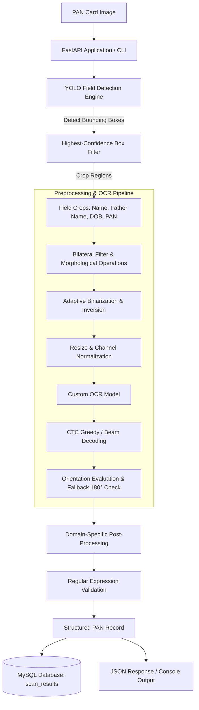

# PAN Card OCR Extraction System

An end-to-end computer vision and OCR pipeline combining YOLO object detection with a custom CTC-based text recognition model to detect, extract, and validate structured information from PAN card images.

---

## Overview

Extracting structured data from Indian Permanent Account Number (PAN) cards using traditional full-frame Optical Character Recognition (OCR) is prone to noise, background interference, security holograms, and misaligned text blocks. Processing an entire card through an OCR engine often leads to misordered fields and poor character recognition accuracy.

This project solves these challenges by implementing a two-stage detection and recognition pipeline:
1. **Targeted Field Detection:** A trained YOLO model first detects and bounds specific fields of interest (`Name`, `Father's Name`, `Date of Birth`, and `PAN Number`).
2. **Dedicated OCR Extraction:** The detected regions are cropped and preprocessed independently through a custom computer vision pipeline before being evaluated by a custom OCR model trained for alphanumeric sequence recognition with Connectionist Temporal Classification (CTC) decoding.

Following OCR inference, domain-specific post-processing algorithms map frequently confused characters (e.g., distinguishing numeric `0` from alphabetic `O` based on field rules) and validate the extracted tokens using regular expressions against official PAN card formatting standards. The system is exposed via a FastAPI REST service supporting single and bulk image ingestion, stores extraction audits in a MySQL database, and includes a lightweight web interface alongside a standalone CLI inference mode.

---

## Key Features

* **YOLO-Based Region Detection:** Isolates critical text fields (`Name`, `Father's Name`, `DOB`, `PAN`) to eliminate non-target card noise.
* **Custom Character Recognition:** Employs a dedicated OCR model coupled with CTC decoding optimized for field-level crops.
* **Specialized Image Preprocessing:** Includes grayscale normalization, bilateral filtering, TopHat/BlackHat morphological operations, and adaptive binarization to maximize character edge definition.
* **Context-Aware Error Correction:** Deterministically resolves common optical character confusion based on field type constraints.
* **Regex Format Validation:** Evaluates extracted text against official PAN pattern formats (`[A-Z]{5}[0-9]{4}[A-Z]{1}`) and Indian standard date formats (`DD/MM/YYYY`).
* **FastAPI Backend:** Asynchronous REST API providing single-item and bulk-upload endpoints.
* **MySQL Persistence:** Automatically catalogs extraction metadata, processing statuses, extracted data fields, and errors into a structured `scan_results` table.
* **Historical Scan Management:** Endpoints for querying historical records by ID or PAN number, as well as record deletion.
* **Interactive Web Interface:** Single-page frontend (`index.html`) for browser-based testing and real-time result inspection.
* **Dual Execution Modes:** Fully functional as a standalone CLI script (`inference.py`) or as a containerized web service.
* **Containerized Deployment:** Includes a production-oriented `Dockerfile` resolving all system-level image rendering dependencies.

---

## System Architecture




### Core Component Responsibilities

* **`app.py`:** Initializes the FastAPI framework, defines request/response schemas, manages database lifecycles, and exposes HTTP endpoints.
* **`inference.py`:** Orchestrates the core machine learning workflow: accepts raw image inputs, triggers YOLO detection, manages field cropping, invokes preprocessing, and directs OCR inference.
* **`preprocess.py`:** Encapsulates OpenCV-based computer vision transformations (denoising, contrast enhancement, morphology, thresholding) tuned specifically for document character separation.
* **`postprocess.py`:** Implements deterministic string-cleaning rules, alphanumeric confusion matrices, and regex validation patterns.
* **`models/`:** Houses the compiled neural network weights for both the YOLO detector and the custom OCR recognizer.
* **`index.html`:** Serves as a client-side interface for file uploads and JSON response rendering.
* **MySQL Database:** Provides persistent relational storage for all audit trails, raw outputs, confidence metrics, and processing errors.

---

## End-to-End Pipeline

### Stage 1 — Input Image Ingestion
Images are received either via FastAPI multipart form uploads (`UploadFile`) or directly from the local filesystem during CLI execution. The file's binary stream is decoded directly into an in-memory BGR NumPy array via `cv2.imdecode`, avoiding redundant disk I/O operations.

### Stage 2 — YOLO Field Detection
The BGR image is fed into the YOLO detection model to identify relevant bounding boxes. The model detects distinct classes:
* `pan_number`
* `name`
* `father_name`
* `dob`

When multiple candidate bounding boxes are predicted for the same class label, the pipeline sorts predictions by confidence score and preserves strictly the highest-confidence bounding box for each class.

### Stage 3 — Field Cropping
Coordinates from the retained bounding boxes are extracted as integer pixel indices `[ymin:ymax, xmin:xmax]`. The script slices the original uncompressed image array into localized bounding box sub-arrays. This spatial attention step isolates relevant text from background watermarks, emblems, and extraneous text.

### Stage 4 — Image Preprocessing
Each localized crop is processed through `preprocess.py` to maximize character-to-background contrast:
1. **Grayscale Conversion:** Simplifies color channels to single-intensity arrays.
2. **Bilateral Filtering:** Smooths out image compression artifacts and paper texture noise while preserving sharp character edge boundaries.
3. **TopHat & BlackHat Morphologies:** Enhances both bright text elements on darker backgrounds and dark text on lighter surfaces.
4. **Adaptive Thresholding:** Locally binarizes the image to handle uneven illumination and shadow gradients across the card.
5. **Morphological Closing & Inversion:** Closes minor internal gaps within character strokes and converts the text into the polarity expected by the OCR model (white text on a black background).

### Stage 5 — OCR & Sequence Decoding
The preprocessed image crops are resized to the fixed spatial dimensions required by the custom OCR model, cast to floating-point tensors, and normalized. The OCR model processes the visual feature representations to predict character probability distributions across the horizontal time-step axis. Connectionist Temporal Classification (CTC) decoding collates the predicted matrix into an initial raw text string based on a predefined alphanumeric character map.

### Stage 6 — Orientation Handling
Document crops with irregular aspect ratios (e.g., portrait-oriented captures) are rotated into a standard horizontal text orientation. The pipeline runs an initial OCR inference pass; if the decoded string fails validation checks or falls below heuristic acceptance criteria, the system applies a 180-degree rotation and re-evaluates the crop, retaining the candidate with the highest validity score.

### Stage 7 — Post-Processing & Character Normalization
Decoded strings undergo dictionary- and position-based corrections via `postprocess.py`:
* **Name Fields (`name`, `father_name`):** Strips non-alphabetic noise and corrects common digit-to-letter confusions (e.g., `0` $\rightarrow$ `O`, `1` $\rightarrow$ `I`, `5` $\rightarrow$ `S`, `8` $\rightarrow$ `B`).
* **Date of Birth (`dob`):** Forces numeric conversions for characters mimicking digits (e.g., `O` $\rightarrow$ `0`, `I` $\rightarrow$ `1`), ensuring standard `DD/MM/YYYY` punctuation formatting.
* **PAN Number:** Enforces the 10-character Indian Income Tax structure:
  * Characters 0–4: Alphabetic only (`[A-Z]`)
  * Characters 5–8: Numeric only (`[0-9]`)
  * Character 9: Alphabetic only (`[A-Z]`)
* **Whitespace & Case:** Removes stray punctuation, normalizes duplicate whitespaces, and converts all strings to uppercase.

### Stage 8 — Validation
The normalized strings are evaluated against strict regular expressions:
* **PAN Number:** `^[A-Z]{5}[0-9]{4}[A-Z]{1}$`
* **Date of Birth:** `^(0[1-9]|[12][0-9]|3[01])/(0[1-9]|1[0-2])/\d{4}$`
* **Names:** `^[A-Z\s]{2,50}$`

The overall document is assigned an `is_pan_card = True` boolean flag only if the primary identity fields satisfy these structural criteria.

---

## Models

The runtime environment depends on two model artifacts stored within the `models/` directory:

1. **YOLO Field Detector (`models/yolo_field_detector.pt`):**
   * **Framework:** Ultralytics YOLO (PyTorch)
   * **Function:** Spatial localization of individual data fields across the card surface.
   * **Inference Details:** Loaded using standard Ultralytics runtime methods. Processes the full card image and outputs bounding box coordinates with class labels and confidence scores.

2. **Custom Sequence OCR Model (`models/custom_ocr_model.keras`):**
   * **Framework:** TensorFlow / Keras (`tf.keras.models.load_model`)
   * **Function:** Sequence-to-sequence optical character recognition.
   * **Architecture:** Combines convolutional feature extraction layers with recurrent layers (e.g., Bidirectional LSTM) trained with a CTC loss function for alignment-free sequence transcription.
   * **Note on Training Specs:** Exact architectural configurations, layer definitions, and hyperparameter logs are documented within the experimental scripts located in `development/ocr_training/`.

---

## API Documentation

FastAPI exposes interactive Swagger documentation at `/docs` and ReDoc at `/redoc`.

### Endpoints Overview

| Method | Endpoint | Description |
| :--- | :--- | :--- |
| `GET` | `/health` | Service health check and dependency connectivity verification. |
| `POST` | `/predict` | Ingests a single PAN card image and returns extracted fields. |
| `POST` | `/predict-bulk` | Accepts an array of image files and returns a batch of extraction records. |
| `GET` | `/scans` | Returns a list of past scan records from the database. |
| `GET` | `/scans/{pan_number}` | Queries historical scans matching a specific PAN number. |
| `DELETE` | `/scans/{scan_id}` | Deletes a scan record from the database by its primary ID. |

---

### Request & Response Examples

#### `POST /predict`
Processes a single image file via multipart form submission.

**cURL Request:**
```bash
curl -X POST "http://localhost:5001/predict" \
  -H "accept: application/json" \
  -H "Content-Type: multipart/form-data" \
  -F "file=@sample_pan_card.jpg"
```

**JSON Response (Success):**
```json
{
  "filename": "sample_pan_card.jpg",
  "pan_number": "ABCDE1234F",
  "name": "SAMPLE CITIZEN",
  "father_name": "PARENT CITIZEN",
  "dob": "15/08/1990",
  "is_pan_card": true,
  "confidence": 0.92,
  "status": "success",
  "error_msg": null
}
```

#### `POST /predict-bulk`
Uploads multiple files concurrently.

**cURL Request:**
```bash
curl -X POST "http://localhost:5001/predict-bulk" \
  -H "accept: application/json" \
  -H "Content-Type: multipart/form-data" \
  -F "files=@card1.jpg" \
  -F "files=@card2.png"
```

**JSON Response:**
```json
[
  {
    "filename": "card1.jpg",
    "pan_number": "ABCDE1234F",
    "name": "SAMPLE CITIZEN",
    "father_name": "PARENT CITIZEN",
    "dob": "15/08/1990",
    "is_pan_card": true,
    "confidence": 0.92,
    "status": "success",
    "error_msg": null
  },
  {
    "filename": "card2.png",
    "pan_number": null,
    "name": null,
    "father_name": null,
    "dob": null,
    "is_pan_card": false,
    "confidence": 0.0,
    "status": "failed",
    "error_msg": "YOLO failed to detect valid PAN fields."
  }
]
```

---

## Database

The application integrates with MySQL using PyMySQL. All extraction events are persisted to the `scan_results` table.

### Schema Structure

```sql
CREATE TABLE IF NOT EXISTS scan_results (
    id INT AUTO_INCREMENT PRIMARY KEY,
    filename VARCHAR(255) NOT NULL,
    pan_number VARCHAR(10),
    name VARCHAR(255),
    father_name VARCHAR(255),
    dob VARCHAR(20),
    is_pan_card BOOLEAN DEFAULT FALSE,
    confidence FLOAT,
    status VARCHAR(50),
    error_msg TEXT,
    created_at TIMESTAMP DEFAULT CURRENT_TIMESTAMP
);
```

Database connection settings are loaded directly from environment variables. If the database is unreachable, write failures are logged without crashing the core inference process.

---

## Project Structure

```text
pan-ocr/
│
├── development/                 # Research, training, and offline experimentation
│   ├── data_preparation/        # Scripts for raw dataset cleaning, cropping, and annotation
│   ├── ocr_training/            # OCR network definition, training notebooks, and CTC loss utilities
│   └── yolo_detection/          # YOLO hyperparameter files, dataset configs, and training logs
│
├── models/                      # Production model binaries used at runtime
│   ├── yolo_pan_detector.pt     # Trained YOLO weights for field localization
│   └── custom_ocr_model.keras   # Trained Keras sequence-recognition OCR model
│
├── app.py                       # FastAPI entry point, REST routes, and database controller
├── inference.py                 # Core runtime pipeline coordinating YOLO, preprocessing, and OCR
├── preprocess.py                # OpenCV image filtering, adaptive thresholding, and morphological operations
├── postprocess.py               # Field-specific character replacements and regex validation rules
├── index.html                   # Static web UI for interactive file uploads and testing
├── Architecture.png             # Pipeline architecture diagram
├── Dockerfile                   # Production container definition
├── requirements.txt             # Pinned project dependencies
├── README.md                    # System documentation
└── .gitignore                   # Version control exclusion rules
```

> **Note on Directory Separation:** The `development/` directory contains offline training and data engineering utilities. The runtime application (`app.py`, `inference.py`, `preprocess.py`, `postprocess.py`, and `models/`) operates independently of the development assets.

---

## Installation

### Prerequisites
* Python 3.9+ installed
* MySQL Server running locally or accessible over the network

### Setup Steps

1. **Clone the Repository:**
   ```bash
   git clone [https://github.com/SahilAgarwal2004/pan-ocr.git](https://github.com/SahilAgarwal2004/pan-ocr.git)
   cd pan-ocr
   ```

2. **Create and Activate a Virtual Environment:**
   * **macOS / Linux:**
     ```bash
     python3 -m venv venv
     source venv/bin/activate
     ```
   * **Windows:**
     ```cmd
     python -m venv venv
     venv\Scripts\activate
     ```

3. **Install Dependencies:**
   ```bash
   pip install --upgrade pip
   pip install -r requirements.txt
   ```

---

## Environment Variables

Create a `.env` file in the root directory (or export variables in your shell) to configure the database and service port:

```env
# Database Configuration
MYSQL_HOST=localhost
MYSQL_USER=root
MYSQL_PASSWORD=your_secure_password
MYSQL_DATABASE=pan_ocr
MYSQL_PORT=3306

# Application Configuration
PORT=5001
```

---

## Running the Application

### Starting the FastAPI Server

Launch the web service directly:
```bash
python app.py
```

Alternatively, use `uvicorn` explicitly:
```bash
uvicorn app:app --host 0.0.0.0 --port 5001 --reload
```

* **Service Address:** `http://localhost:5001`
* **Health Check:** `http://localhost:5001/health`
* **Swagger Documentation:** `http://localhost:5001/docs`

---

## Running Standalone Inference

The pipeline can be executed directly from the terminal without initiating the FastAPI server:

```bash
python inference.py --image path/to/pan_card.jpg
```

### CLI Execution Workflow
1. Loads YOLO and OCR models into memory.
2. Ingests and detects target fields in the specified image.
3. Crops and runs morphological preprocessing on detected regions.
4. Executes OCR text recognition and applies post-processing corrections.
5. Prints execution timings and the final structured payload directly to `stdout`.

---

## Web Interface

The repository includes a lightweight browser client (`index.html`) to facilitate visual testing:

1. Open `index.html` in any modern web browser (or serve it via a simple static file server).
2. Use the file picker to select a local PAN card image.
3. Click **Extract Details**.
4. The client dispatches a `multipart/form-data` request to `POST /predict`, parses the JSON response, and displays:
   * Verification status (`is_pan_card`)
   * Extracted PAN Number, Name, Father's Name, and Date of Birth
   * Bounding box visualization (when supported by the response payload)

---

## Docker

The application can be built and deployed as a standalone Docker container. The included `Dockerfile` installs system-level dependencies required by OpenCV (such as `libgl1-mesa-glx` and `libglib2.0-0`), installs the Python requirements, and starts the FastAPI server.

### Build the Image
```bash
docker build -t pan-ocr:latest .
```

### Run the Container
```bash
docker run -d \
  --name pan-ocr-service \
  -p 5001:5001 \
  --env-file .env \
  pan-ocr:latest
```

---

## Development and Training

The `development/` folder provides the historical training and engineering codebase used to produce the runtime models:

* **`development/data_preparation/`:**
  Contains scripts used to convert raw card scans into standardized YOLO annotation formats, alongside cropping utilities used to create character-level datasets.
* **`development/yolo_detection/`:**
  Houses dataset definition files (`data.yaml`), training execution scripts using the Ultralytics framework, validation split managers, and bounding-box regression loss evaluations.
* **`development/ocr_training/`:**
  Contains Keras/TensorFlow model architectures combining CNN backbones with recurrent BiLSTM layers, CTC loss calculation functions, character label dictionary encoders, and training history logs.

---

## Technical Stack

| Component | Technology |
| :--- | :--- |
| **Primary Language** | Python 3 |
| **Web Framework** | FastAPI, Starlette, Uvicorn |
| **Computer Vision** | OpenCV (`opencv-python`), NumPy |
| **Object Detection** | Ultralytics YOLO |
| **Character Recognition** | TensorFlow / Keras (Custom CTC Architecture) |
| **Database & ORM** | MySQL, PyMySQL |
| **Containerization** | Docker |
| **Frontend Testing** | HTML5, Vanilla JavaScript, CSS3 |

---

## Design & Engineering Decisions

* **Two-Stage Architecture (Detection $\rightarrow$ OCR):** PAN card backgrounds feature complex watermarks, governmental seals, and multilingual security text. Passing entire card frames to OCR models results in severe character hallucinations. Using YOLO as a spatial attention mechanism ensures the OCR model only evaluates clean, targeted crops.
* **Domain-Specific Character Disambiguation:** General OCR engines struggle to distinguish visually identical glyphs such as `8` vs. `B` or `0` vs. `O`. Knowing the syntactic rules of each field allows the post-processing module to resolve character ambiguities deterministically.
* **Highest-Confidence Bounding Box Filtering:** Document reflections or low contrast can cause multi-box predictions for the same field label. Discarding all but the highest-confidence box prevents race conditions during crop generation.
* **Decoupled Training and Runtime Code:** Segregating heavy training scripts, validation notebooks, and dataset preparation utilities into `development/` keeps the production image lean and focused on low-latency inference.

---

## Limitations

* **Resolution Dependency:** Severe motion blur, low image resolution (under ~300 DPI equivalent), or extreme compression artifacts will impair the OCR model's ability to segment characters accurately.
* **Cascading Pipeline Failure:** If the YOLO model fails to localize a specific field bounding box, the downstream OCR step cannot recover the missing text.
* **Syntactic vs. Semantic Verification:** Regular expression validation guarantees that the extracted string conforms to PAN formatting rules, but cannot verify whether the PAN is actively registered with the Income Tax Department database.
* **Confidence Metrics:** The system relies on detection-level scores and heuristic thresholds rather than calibrated, end-to-end token uncertainty distributions.

---

## Future Improvements

* **Asynchronous Task Queues:** Integrating Celery with Redis to process large bulk uploads without holding HTTP connections open.
* **Dynamic Perspective Correction:** Adding four-point document corner detection to automatically deskew and unwarp cards photographed at acute angles.
* **External NSDL / UTIITSL API Verification:** Integrating government-authorized verification APIs to confirm that extracted PAN records match active tax registries.
* **Automated Testing & CI/CD:** Building automated unit tests for `preprocess.py` and `postprocess.py` alongside GitHub Actions workflows for continuous container builds.
* **End-to-End Metric Calibration:** Formulating a composite confidence score that mathematically combines YOLO bounding box probabilities with CTC sequence decode likelihoods.

---

## Example Output

### Successful Extraction (`POST /predict`)
```json
{
  "filename": "sample_pan.jpg",
  "pan_number": "ABCDE1234F",
  "name": "FIRSTNAME LASTNAME",
  "father_name": "FATHER FIRSTNAME LASTNAME",
  "dob": "12/04/1992",
  "is_pan_card": true,
  "confidence": 0.94,
  "status": "success",
  "error_msg": null
}
```

### Failed / Invalid Document Output
```json
{
  "filename": "unrelated_document.pdf",
  "pan_number": null,
  "name": null,
  "father_name": null,
  "dob": null,
  "is_pan_card": false,
  "confidence": 0.0,
  "status": "failed",
  "error_msg": "Document failed PAN validation criteria: Missing required fields."
}
```

---

## Security Considerations

* **Secrets Isolation:** Never commit active database passwords or `.env` credential files to version control. Maintain an `.env.example` file for local development templates.
* **CORS Restrictions:** Configure FastAPI's `CORSMiddleware` with explicit origin domain whitelists prior to deploying in production environments.
* **Input Validation:** Enforce strict file size limits and verify magic byte signatures on incoming multipart uploads to guard against arbitrary file execution vulnerabilities.
* **Data Privacy:** PAN cards contain Sensitive Personally Identifiable Information (PII). Ensure MySQL storage volumes are encrypted at rest and access logs are redacted in compliance with relevant data privacy regulations.

---

## Author & Contact

**Sahil Agarwal**  
GitHub: [https://github.com/SahilAgarwal2004](https://github.com/SahilAgarwal2004)
