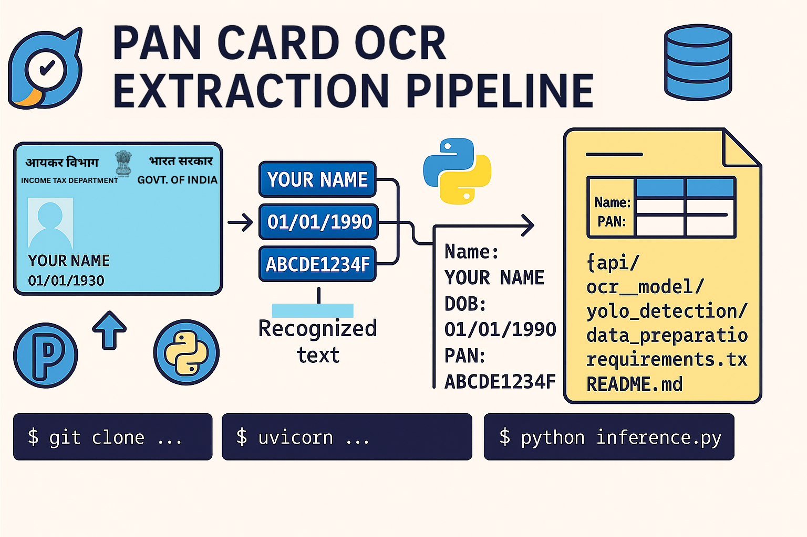

# PAN OCR API & Inference Project


This project is a complete solution for extracting fields from PAN card images. It uses a YOLO model for detecting specific fields like Name, DOB, PAN Number, etc., and a custom OCR model for reading text. The backend is powered by FastAPI, making the project fast, scalable, and easy to deploy.

---

## Key Features

- REST API to upload PAN card images and get extracted fields
- YOLO-based object detection to locate fields on the card
- Custom OCR model for reading the detected fields
- Database integration to store and manage results
- Standalone inference script without needing the API
- Tools for data preparation, annotation, and training

---

## Project Structure

```

pan-ocr-project/
├── api/                    # FastAPI app and database logic
├── ocr_model/              # OCR model, training and inference
├── yolo_detection/         # YOLO model training and annotation scripts
├── data_preparation/       # Scripts for data cleanup and merging
├── requirements.txt        # Python dependencies
├── README.md               # Project documentation

````

---

## Getting Started

### 1. Clone the Repository

```bash
git clone hub.com/SahilAgarwal2004/pan-ocr.git
cd pan-ocr-project
````

### 2. Create a Virtual Environment and Install Dependencies

```bash
python -m venv venv
source venv/bin/activate  # On Windows: venv\Scripts\activate
pip install -r requirements.txt
```

---

## Running the API

### Start the FastAPI Server

```bash
uvicorn api.main:app --host 0.0.0.0 --port 8000 --reload
```

* API base URL: [http://localhost:8000](http://localhost:8000)
* API documentation (Swagger): [http://localhost:8000/docs](http://localhost:8000/docs)
* Health check: [http://localhost:8000/health](http://localhost:8000/health)

---

### API Endpoints

| Method | Endpoint                     | Description                       |
| ------ | ---------------------------- | --------------------------------- |
| POST   | /ocr/process                 | Upload and process PAN card image |
| GET    | /ocr/results/{id}            | Get OCR result by ID              |
| GET    | /ocr/results                 | Get all OCR results               |
| GET    | /ocr/results/filename/{name} | Get result by filename            |
| GET    | /ocr/download/{id}           | Download original uploaded image  |
| DELETE | /ocr/results/{id}            | Delete result and associated file |
| GET    | /health                      | API health check                  |

---

### Example: Upload Image Using curl

```bash
curl -X POST "http://localhost:8000/ocr/process" \
  -F "file=@/path/to/your/pan_image.jpg"
```

---

## Running Inference Without API

You can also run the OCR model directly on an image without using the API.

```bash
python ocr_model/inference.py path/to/your/image.jpg
```

The result will show the extracted fields in the terminal or as JSON.

---

## Data Preparation and Training

* Scripts for cleaning, annotating, and merging data are in `data_preparation/`
* YOLO training and image cropping tools are in `yolo_detection/`
* OCR training and utilities are in `ocr_model/`


